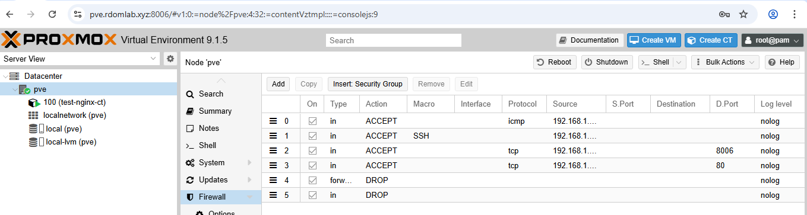
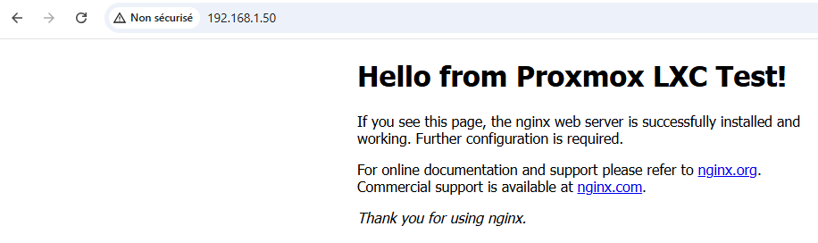
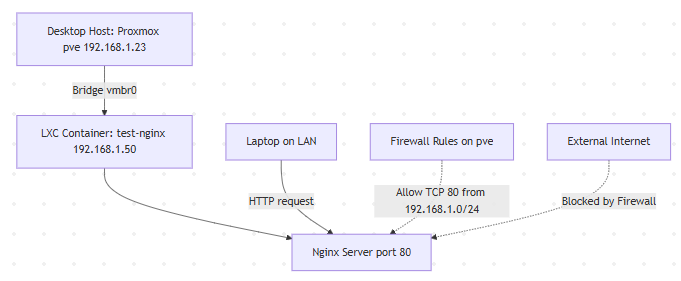

# Phase 2 – First LXC Container: Ubuntu with Nginx Hello World

## Goal
Create a lightweight LXC container on Proxmox to host a simple nginx "Hello World" web server. This demonstrates Proxmox container management, basic networking/firewall testing, and serves as a testbed for future Kubernetes nodes (e.g., deploying resume site pods).

## Why LXC for This Project?
- LXC (Linux Containers) are lighter/faster than full VMs (share host kernel) — ideal for homelab efficiency on my Ryzen 9 hardware (low overhead, quick start).
- Preps for enterprise K8s: LXCs teach container isolation (namespaces, cgroups) without Docker/K8s yet.
- Why nginx? Simple static site test (mirrors Hugo resume site later); verifies network access via Proxmox bridge/firewall.
- Security tie-in: Run as non-root, test firewall rules (allow port 80 from LAN only).
- Architecture knowledge: Proxmox LXC sits on host (pve) → bridged network (vmbr0) → LAN IP → accessible from laptop but blocked externally.

## High-Level Architecture Diagram (Mermaid)

## Troubleshooting
Fixed with sudo vim — always use sudo for system files even as sudoer.
